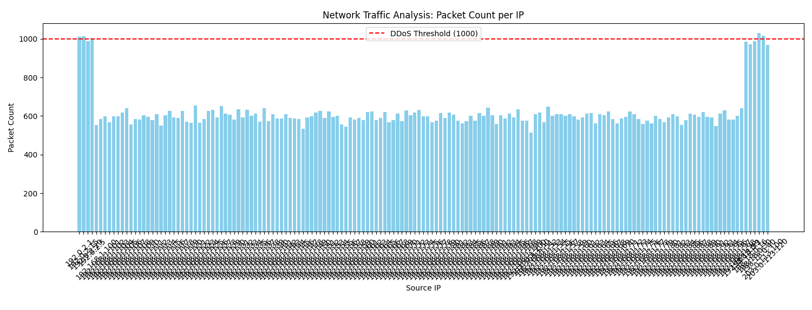

# NETGUARD NETWORK TRAFFIC DETECTOR 🛡️  
 > A network traffic simulation and analysis tool, detecting potential DDoS attacks using statistical analysis.  

## INTRODUCTION 📖  
**NETGUARD** is a Python project that applying OOP for network system simulation, generating mixed network traffic among hackers and normal. Using **Pandas** and **Matplotlib** for network log analyzing, data visualization and anomalies alert automatically.  

## FEATURES 🚀  
- **Traffic Generator:** Simulate TCP/UDP packets with custom configuration (normal IPs and attack IPs) via 'config.json' file.  
- **OOP Design:** Standard system design with classes 'TrafficGenerator', 'NetworkAnalyzer'.  
- **Data Analysis:** Using **Pandas** for traffic statistics calculating.  
- **Visualization:** Draw a graph to visualize the number of packets sent from each IP, helping to identify Hackers immediately.  

## TECHNOLOGY 🛠️  
- **Language:** Python 3  
- **Core:** NumPy, Pandas  
- **Visualization:** Matplotlib  
- **Format:** CSV, JSON  

# HOW TO USE 🔧  
1. Library installation
```Bash
    pip install -r requirements.txt
```  

2. Configuration *(optional)*  
You could edit **config.json** file to add/del simulated IPs:
```JSON
    {
        "target_ip": "192.168.1.1",
        "ddos_ips": ["10.0.0.66", "10.0.0.99"]
    }
```  
3. Run program  
```Bash
    python main.py
```  

## SIMULATION RESULT 📊  
Once run, the program will output a CSV file at *~/data/network_traffic.csv* and display the analysis graph  


## CONTRIBUTION 🧱  
**TECHJUSTICE** :: End-to-End Development for NETGUARD (v1.0).

